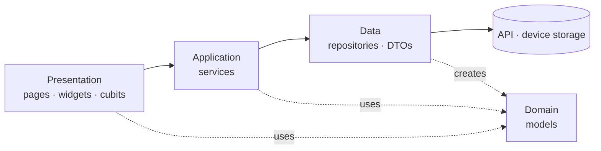

# Flutter Clean Architecture Template

[](LICENSE)

A starting point for real Flutter apps. You get:
- a feature-first clean architecture built on Cubit, get_it, go_router and Dio,
- a working sign-in flow with token refresh,
- a paged, searchable list,
- tests for every layer.

Clone it, rename it with one command, and start building features instead of wiring up folders.

**New to clean architecture?** Read [Clean Architecture in Flutter](https://medium.com/@m1nori/clean-architecture-in-flutter-b00aa22ffad3) on Medium. It's a beginner-friendly walkthrough of this template: why it's built this way, how a tap travels through the layers, and when the approach is overkill.

- [Quick start](#quick-start)
- [Why this architecture](#why-this-architecture)
- [The four layers](#the-four-layers)
- [Project structure](#project-structure)
- [What's included](#whats-included)
- [How the pieces fit together](#how-the-pieces-fit-together)
- [Adding a feature](#adding-a-feature)
- [Environments](#environments)
- [Connecting your own backend](#connecting-your-own-backend)
- [FAQ](#faq)
- [License](#license)

## Quick start

You need **Flutter 3.47.2**. The version is pinned in `.fvmrc`, so with [FVM](https://fvm.app) run `fvm use` and put `fvm` in front of the commands below.

`.vscode/settings.json` tells VS Code to use the FVM copy of the SDK (`.fvm/versions/3.47.2`). If you don't use FVM, delete that file or point `dart.flutterSdkPath` at your own Flutter 3.47.2. An older SDK can't resolve `sdk: ^3.13.0`, and every file shows errors.

**1. Get the code**

On GitHub, click **Use this template → Create a new repository** and clone your new repository. Or, without GitHub:

```sh
git clone --depth 1 https://github.com/valentynapolienova/flutter_clean_architecture_template.git my_app
cd my_app
rm -rf .git && git init
```

**2. Rename it**

```sh
./tool/rename.sh my_app com.mycompany "My App"
```

This one command updates the Dart package name and every import, the Android application ID, the iOS bundle identifier and the app's display name.

**3. Run it**

```sh
flutter pub get
flutter run -t lib/main_dev.dart --dart-define-from-file=env/dev.json
```

Or pick the **dev** configuration in VS Code or Android Studio.

The example app talks to [DummyJSON](https://dummyjson.com), a free test API. Tap **Use demo account** on the login screen, or sign in as `emilys` / `emilyspass`. Then scroll the posts, search them, and open one.

## Why this architecture

In many Flutter apps, everything ends up inside widgets: API calls, JSON parsing, business rules, error handling. It works at first. Then:

- a small API change means editing several screens,
- a business rule can only be tested by clicking through the app,
- everyone structures features differently, so reviews turn into debates.

This template gives each feature four layers, and each layer has one job. That gives you:

| Benefit | What it means day to day |
|---|---|
| **Changes stay local** | The backend renamed a field? Change one DTO. Screens don't notice. |
| **Easy to test** | Every class gets its dependencies through its constructor, so business logic is tested with plain Dart tests and mocks. |
| **Predictable** | Every feature has the same folders, so you always know where code lives and where new code goes. |
| **Errors handled in one place** | Each kind of error is one type, from the network call all the way to a translated message on screen. The compiler reminds you to handle a new one. |
| **Scales with the team** | Features are independent folders, so people rarely edit the same files. |
| **Works with AI agents** | The conventions are written down in [`AGENTS.md`](AGENTS.md), so coding agents write code that fits. |

**When is it too much?** For a throwaway prototype or a one-screen app, four layers are more structure than you need.

## The four layers



The snippets below come from the `posts` feature.

### Data: talks to the outside world

**Repositories** call the API or device storage and turn the raw responses (**DTOs**) into domain models. When something goes wrong they throw a typed failure.

```dart
// data/dto/post_dto.dart: shaped like the API
Post toDomain() => Post(id: id, authorId: userId, title: title, ...);
```

The API says `userId` and the app says `authorId`. The DTO is the only place that knows both names.

### Domain: what the app is about

These are plain Dart models such as `Post`, `Author` and `User`. They contain no Flutter, no JSON and no networking.

### Application: business logic

**Services** hold the rules: combining data, normalizing input, deciding what happens next. Every method returns a `Failable<T>`, which is either `Succeeded(value)` or `Failed(failure)`, so callers can't forget the error case.

```dart
FutureFailable<PostDetails> getPostDetails(int postId) {
  return RepositoryRequestHandler<PostDetails>()(
    request: () async {
      final post = await postsRepository.fetchPost(postId);
      final author = await authorsRepository.fetchAuthor(post.authorId);
      return PostDetails(post: post, author: author);
    },
  );
}
```

### Presentation: what the user sees

A **Cubit** calls a service and emits states such as loading, loaded or failed. **Pages** render them, and the compiler checks that every state is handled.

```dart
Future<void> load(int postId) async {
  emit(const PostDetailsLoading());
  final result = await _service.getPostDetails(postId);
  emitIfOpen(
    result.when<PostDetailsState>(
      success: PostDetailsLoaded.new,
      failure: PostDetailsFailed.new,
    ),
  );
}
```

The layering follows Andrea Bizzotto's [Flutter App Architecture](https://codewithandrea.com/articles/flutter-app-architecture-riverpod-introduction/) article, but uses Cubit and get_it instead of Riverpod.

## Project structure

```
lib/
├── main_dev.dart / main_prod.dart   # one entry point per environment
├── app/                             # wiring: startup, config, DI, navigation
│   ├── app.dart
│   ├── bootstrap.dart
│   ├── config/app_config.dart
│   ├── di/service_locator.dart
│   └── router/                      # routes, session guard
├── core/                            # building blocks used by every feature
│   ├── cubit/                       # EmitGuardMixin, PagingMixin, DebounceMixin
│   ├── errors/                      # AppFailure
│   ├── extensions/                  # context.l10n, failure.toMessage(...)
│   ├── logging/                     # AppLogger
│   ├── network/                     # ApiClient, AuthInterceptor
│   ├── result/                      # Failable, PageSlice, RepositoryRequestHandler
│   ├── storage/                     # settings and secure token storage
│   ├── theme/                       # AppTheme, AppColors, Spacing, ThemeCubit
│   └── widgets/                     # ErrorView, PageLoader, ...
├── features/
│   ├── auth/                        # login, session, token refresh
│   └── posts/                       # paged + searchable list, details
│       ├── data/                    # repositories, dto/
│       ├── domain/                  # models
│       ├── application/             # services
│       └── presentation/            # cubits/, pages/, widgets/
└── l10n/                            # app_en.arb (+ generated/)
test/                                # mirrors lib/
env/                                 # dev.json, prod.json
tool/rename.sh
```

## What's included

| Concern | Solution | Where |
|---|---|---|
| State management | [flutter_bloc](https://pub.dev/packages/flutter_bloc) (Cubit) | `features/*/presentation/cubits` |
| Dependency injection | [get_it](https://pub.dev/packages/get_it) | `app/di` |
| Navigation and route guard | [go_router](https://pub.dev/packages/go_router) | `app/router` |
| Networking | [dio](https://pub.dev/packages/dio) behind `ApiClient` | `core/network` |
| Authentication | Login, stored session, automatic token refresh | `features/auth`, `core/network/auth_interceptor.dart` |
| Paging and search | `PagingMixin` and `DebounceMixin` for cubits | `core/cubit` |
| Error handling | Sealed `AppFailure` → `Failable<T>` → translated message | `core/errors`, `core/result` |
| Device storage | [shared_preferences](https://pub.dev/packages/shared_preferences) for settings, [flutter_secure_storage](https://pub.dev/packages/flutter_secure_storage) for tokens | `core/storage` |
| Localization | Flutter's `gen-l10n` (ARB files) | `lib/l10n` |
| Theming | Material 3, light and dark, remembered between launches | `core/theme` |
| Logging | `AppLogger` on `dart:developer`, with one hook for crash reporting | `core/logging` |
| Environments | `main_<env>.dart` + `env/<env>.json` | `lib/`, `env/` |
| Lints | [very_good_analysis](https://pub.dev/packages/very_good_analysis), [bloc_lint](https://pub.dev/packages/bloc_lint) | `analysis_options.yaml` |
| Tests | [bloc_test](https://pub.dev/packages/bloc_test), [mocktail](https://pub.dev/packages/mocktail), [fake_async](https://pub.dev/packages/fake_async) | `test/` |
| CI | GitHub Actions: format, analyze, bloc lint, tests | `.github/workflows/ci.yaml` |
| AI instructions | `AGENTS.md` (Claude Code reads it through `CLAUDE.md`) | root |

### Everyday commands

```sh
flutter run -t lib/main_dev.dart --dart-define-from-file=env/dev.json
flutter gen-l10n                                 # after editing lib/l10n/app_en.arb
dart format lib test
flutter analyze --fatal-infos --fatal-warnings
flutter test
dart pub global activate bloc_tools && bloc lint .
```

## How the pieces fit together

### Errors

- `ApiClient` turns a network error into an `AppFailure`: `NoConnectionFailure`, `TimeoutFailure`, `ServerFailure`, `UnauthorizedFailure`, and so on.
- A repository can pass that failure on unchanged, or replace it with a more specific one. For example, the login endpoint's HTTP 400 becomes `InvalidCredentialsFailure`.
- `RepositoryRequestHandler` in the service catches the failure and returns it as `Failed(...)`. Anything else that goes wrong becomes `UnexpectedFailure` and is logged.
- The cubit puts the failure into its state, and the page shows `failure.toMessage(context.l10n)`.

`AppFailure` is sealed, so when you add a new failure the compiler points you to the message you still have to write.

### Authentication

1. At startup, `SessionCubit.restore()` checks for a stored token and loads the current user. Until that finishes the router shows the splash screen, and afterwards it sends the user to login or to the posts.
2. Signing in saves the tokens in secure storage and updates `SessionCubit`. The router then moves the user off the login page.
3. `AuthInterceptor` adds `Authorization: Bearer <token>` to every request. When a request comes back with 401, it refreshes the token once and retries. If the refresh fails, the user is signed out.

### Paging and search

`PostsListCubit` mixes in two helpers:
- **`PagingMixin`:** it asks the service for the next page, ignores duplicate scroll triggers and throws away pages that arrive after a new search.
- **`DebounceMixin`:** it waits until the user stops typing before searching.

### Crash reporting

Uncaught errors and every `AppLogger.error` call go to `AppLogger.errorReporter`. Point it at Crashlytics or Sentry in `bootstrap.dart`, and nothing else needs to change.

## Adding a feature

Use `lib/features/posts/` as the model. For a feature called `orders`:

1. **Domain:** add `domain/order.dart`, a plain Dart model.
2. **Data:** add `data/dto/order_dto.dart` (with `fromJson` and `toDomain`) and `data/orders_repository.dart`.
3. **Application:** add `application/orders_service.dart`, returning `FutureFailable<...>`.
4. **Presentation:** add `presentation/cubits/orders/` (cubit and state), `presentation/pages/orders_page.dart` and any widgets.
5. **Wire it up:**
   - Add an `_registerOrders()` function to `app/di/service_locator.dart`.
   - Add a route to `app/router/app_router.dart` that creates the cubit.
6. **Strings:** add them to `lib/l10n/app_en.arb`.
7. **Tests:** put them under `test/features/orders/`, mirroring the `lib` paths.

With an AI agent, you can simply ask: *"Add an orders feature following AGENTS.md"*.

## Environments

Each environment has an entry point (`lib/main_dev.dart`, `lib/main_prod.dart`) and a JSON file (`env/dev.json`, `env/prod.json`). The JSON values reach `AppConfig` through `--dart-define-from-file`.

- **Adding a value:** add the key to both JSON files, add a field to `AppConfig` and read it in both entry points.
- **Secrets:** never commit them. Use `env/*.local.json` (ignored by git) or your CI's secret store.
- **Separate app IDs, names or icons per environment** need native flavors. They aren't set up, so the template runs on every platform without Xcode setup. Follow Flutter's guides for [Android](https://docs.flutter.dev/deployment/flavors) and [iOS](https://docs.flutter.dev/deployment/flavors-ios).

## Connecting your own backend

1. Put your API URL in `env/dev.json` and `env/prod.json`.
2. In `features/auth/data/`, change the endpoint paths and the DTO fields in `AuthRepository` to match your API. The service, cubits and interceptor stay as they are.
3. Delete the posts example (`lib/features/posts/`, `test/features/posts/`, its routes and `_registerPosts`) and add your own features.
4. Remove the demo account button from `LoginPage`.

## FAQ

**Why Cubit and not Bloc?**
Cubits are plain method calls with less boilerplate. Use a `Bloc` for a single class when you need event transformers.

**Why services instead of use cases?**
One class per operation creates many one-line files. A service groups related operations and still keeps business logic out of the UI. Split it when it grows too big.

**Why no repository interfaces?**
mocktail mocks concrete classes, so a one-implementation interface adds nothing. Storages do have interfaces, because the platform implementation can be swapped.

**Why no code generation?**
The models are small enough to write by hand, and the build stays fast. Add freezed or json_serializable when your models grow.

**Where do logs show up?**
In the IDE debug console and in the DevTools Logging view. `AppLogger` writes through `dart:developer`.

**Which platforms are included?**
Android and iOS. Add others with `flutter create --platforms=web,macos .`.

**Useful packages to add when you need them:** [hive_ce](https://pub.dev/packages/hive_ce) for offline data, [flutter_svg](https://pub.dev/packages/flutter_svg), [cached_network_image](https://pub.dev/packages/cached_network_image), [url_launcher](https://pub.dev/packages/url_launcher), [flutter_native_splash](https://pub.dev/packages/flutter_native_splash) and [flutter_launcher_icons](https://pub.dev/packages/flutter_launcher_icons).

## License

[MIT No Attribution (MIT-0)](LICENSE). You can use, copy, modify and ship this template in any project, commercial or not. You don't need to keep the copyright notice or credit the author.
